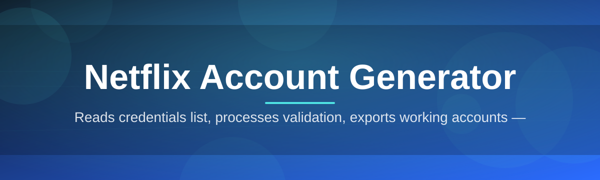
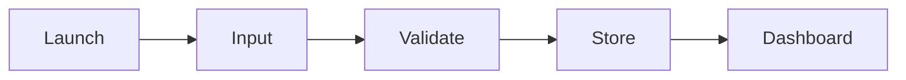

# netflix-account-manager 🍿🔐

  

*One click, one clean session — account management for Netflix, minus the busywork.*

## 🎬 Overview

Managing multiple Netflix profiles, session slots, and login credentials by hand is a tedious, error-prone chore — copy-paste fatigue, forgotten passwords, and browser tabs multiplying like rabbits. **netflix-account-manager** exists to take that manual grind and turn it into a single streamlined desktop workflow, built by a solo developer who got tired of doing it the slow way and decided to ship something that just works.

This tool is a lightweight Windows utility built around the core idea of a *Netflix Account Generator* — a local, self-contained manager that organizes, generates, and validates account session data in a structured, repeatable way. It's not a cloud service, it's not a browser extension riddled with permissions you don't understand — it's a native `.exe` that opens, does its job, and gets out of your way.

Who is this for? Households juggling shared subscriptions, testers who need disposable session profiles for QA work, and anyone who wants a tidy dashboard instead of a spreadsheet full of half-remembered logins. If you've ever thought "there has to be a faster way to handle this," that's exactly the itch this project scratches.

  

---

## ⚡ What It Actually Does

  

- **Instant Profile Scaffolding** — spins up organized account slots in seconds so you're never digging through browser history to find what you saved last week.

- **Session Health Checks** — a built-in validator pings account status and flags dead or expired sessions before you waste time clicking around.

- **Local-First Storage** — everything lives on your machine in an encrypted local vault, not on some third-party server you have to trust blindly.

- **One-Window Dashboard** — every account, profile, and status indicator lives in a single pane, no tab-hopping required.

- **Batch Actions** — refresh, archive, or clean up multiple entries at once instead of repeating the same three clicks fifty times.

- **Smart Naming Conventions** — auto-labels entries by creation date and status so your list stays readable even when it grows large.

- **Portable Mode** — run it straight off a USB stick with zero install footprint left on the host machine.

- **Dark & Light Rendering** — matches your OS theme automatically, because squinting at a white dashboard at 2 AM is nobody's idea of fun.

> [!TIP]
> Pin the app to your taskbar after first launch — most users open it dozens of times a week once it's part of the routine.

---

## 🚀 Getting Started

1. Visit the landing page using the download button below.

2. Grab the latest Windows build — no installer wizard, no bloated setup screens.

3. Double-click the executable. Windows SmartScreen may flag it as unrecognized on first run since it's an independently signed solo-dev build — click "More info → Run anyway."

4. You're in. The dashboard loads immediately with an empty workspace ready for your first account entry.

> [!NOTE]
> First launch generates a local config folder in `%APPDATA%`. Nothing is sent anywhere — it's purely for storing your local preferences and vault data.

---

## 🖥️ System Requirements

| Component | Minimum | Recommended |
|---|---|---|
| **OS** | Windows 10 (64-bit) | Windows 11 (64-bit) |
| **RAM** | 2 GB | 4 GB+ |
| **Disk Space** | 150 MB free | 500 MB free |
| **Dependencies** | None — fully standalone | None |
| **Internet** | Only for landing page download | Optional, for validator pings |

> [!IMPORTANT]
> This is a Windows-only build for 2026. There is currently no macOS or Linux release — running it under Wine or a compatibility layer is unsupported and may behave unpredictably.

---

## 🧩 How It Works

The internal flow is intentionally simple — no hidden background services, no telemetry daemons, just a linear pipeline from input to result.

1. **Launch** — the app boots its local dashboard and reads your existing vault (if any).
2. **Input** — you add or import account entries through the UI.
3. **Process** — the internal engine validates, organizes, and tags each entry.
4. **Store** — everything gets written back to the encrypted local vault.
5. **Output** — the dashboard refreshes with a clean, current view.

---

## 🛟 Troubleshooting

<strong>The app won't launch after download — Windows blocks it.</strong>

This is standard SmartScreen behavior for unsigned or newly-signed independent builds. Click "More info," then "Run anyway." The binary is not corrupted — it's simply new enough that Windows hasn't built reputation trust for it yet.

<strong>My saved entries disappeared after an update.</strong>

Check `%APPDATA%` for a leftover config folder from the previous version. Vault data is portable between versions but occasionally lands in a differently-named subfolder after a major release — copy it into the new expected path.

<strong>The status validator says "unreachable" for everything.</strong>

This usually means your firewall or antivirus is silently blocking outbound pings from the executable. Add an exception for the app in your firewall settings and retry.

<strong>Can I run this on a shared or public computer?</strong>

Portable mode is designed exactly for this — it leaves no registry entries and stores its vault alongside the executable itself, so nothing lingers after you delete the folder.

<strong>Dark mode isn't applying correctly.</strong>

Toggle it manually in Settings → Appearance. Auto-detection reads the Windows theme at launch only, so switching your OS theme mid-session won't update it live yet.

> [!WARNING]
> Always download from the official landing page linked in this README. Third-party mirrors are not maintained by this project and may distribute tampered builds.

---

## 🎨 UI / UX Details

| Shortcut | Action |
|---|---|
| `Ctrl + N` | New account entry |
| `Ctrl + R` | Refresh session status |
| `Ctrl + D` | Toggle dark/light theme |
| `Ctrl + F` | Quick search dashboard |
| `Delete` | Archive selected entry |
| `Esc` | Close active modal |

- **Themes**: System-synced, Dark, Light — switchable anytime in Settings.
- **Compact View**: Collapses the dashboard into a denser table layout for power users managing large lists.
- **Notification Toasts**: Subtle, dismissible, non-blocking — no modal pop-ups interrupting your flow.

> [!TIP]
> Enable Compact View if you're managing more than fifteen entries — it cuts scroll distance dramatically.

---

## 🤝 Contributing & Community

This started as a solo-dev project, but issues, feature requests, and pull requests are genuinely welcome. Found a bug? Open an issue with reproduction steps. Got an idea that fits the "ships fast, no bloat" philosophy? Fork it, build it, send a PR.

> [!NOTE]
> Please keep PRs focused and small — this project favors incremental, reviewable changes over massive rewrites.

---

## 📄 License

Released under the [MIT License](LICENSE), 2026. Use it, fork it, build on it — just keep the attribution intact.

---

## ⚠️ Disclaimer

This project is an independent tool provided for personal account organization and management purposes only. It is not affiliated with, endorsed by, or sponsored by Netflix, Inc. All trademarks belong to their respective owners. Use responsibly and in accordance with the terms of service of any platform you manage accounts for.

  

